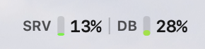
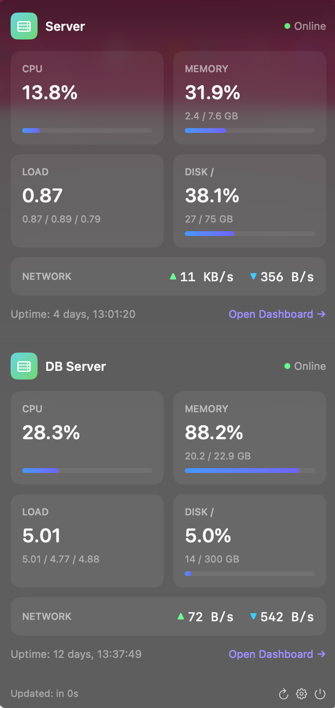

# ServerStats

A native macOS menu bar app for monitoring servers running [Glances](https://nicolargo.github.io/glances/). Inspired by iStats Menus.

  

## Features

- **Menu Bar** — CPU fill bar (green→yellow→red) with percentage per server, alert badges when thresholds are exceeded
- **Dropdown** — Card-based grid showing CPU, Memory, Load, Disk, Network, and Uptime per server with progress bars
- **Notifications** — macOS notifications on first threshold breach, with hysteresis to prevent flapping
- **Configurable** — Add/remove/reorder servers, set CPU/RAM/Load thresholds per server, adjust refresh interval
- **Dark Mode** — Dropdown always dark, status bar adapts to system light/dark appearance
- **Launch at Login** — Built-in toggle via SMAppService
- **No dependencies** — Pure Swift/SwiftUI, no external packages

## Screenshots

<p align="center">
  
  <br><br>
  
</p>

## Requirements

- macOS 14 (Sonoma) or later
- [Glances](https://nicolargo.github.io/glances/) running on your servers with the web UI enabled (`glances -w`)
- Servers accessible via HTTPS

## Installation

### Build from Source

1. Install [XcodeGen](https://github.com/yonaskolb/XcodeGen): `brew install xcodegen`
2. Clone the repo: `git clone https://github.com/YOUR_USERNAME/ServerStats.git`
3. Generate the Xcode project: `xcodegen generate`
4. Build: `xcodebuild build -scheme ServerStats -configuration Release -destination 'platform=macOS' -derivedDataPath build`
5. Copy to Applications: `cp -R build/Build/Products/Release/ServerStats.app /Applications/`

### First Launch

On first launch, right-click the app and select **Open** (required for unsigned apps). The app appears in the menu bar — click the icon and go to **Settings** to add your Glances servers.

## Configuration

Click the gear icon in the dropdown footer to open Settings:

### Server Tab
- **Add Server** — Name, short name (shown in menu bar), Glances base URL (HTTPS only)
- **Thresholds** — CPU, RAM, and Load thresholds per server (alert badges + notifications when exceeded)
- **Reorder** — Drag to reorder servers in the menu bar and dropdown
- **Delete** — Trash icon to remove a server

### General Tab
- **Refresh Interval** — How often to poll servers (5–120 seconds, default 30s)
- **Launch at Login** — Start automatically on login
- **Notification Status** — Shows if notifications are disabled at the system level

## Glances Setup

ServerStats connects to the Glances REST API (v4). Start Glances on your server:

```bash
# Basic (HTTP, local only)
glances -w

# With HTTPS via reverse proxy (recommended)
# Set up nginx/caddy/traefik to proxy HTTPS → localhost:61208
```

The app requires HTTPS — use a reverse proxy (nginx, Caddy, Traefik) with a valid TLS certificate in front of Glances.

## Architecture

```
ServerStatsApp          — SwiftUI App, MenuBarExtra (.window style)
├── Models/
│   └── ServerData      — Codable API models, ServerConfig, ServerState
├── Services/
│   └── GlancesService  — Async HTTP client with redirect protection
├── ViewModels/
│   └── ServerMonitor   — ObservableObject, polling, thresholds, notifications
└── Views/
    ├── StatusBarView   — CoreGraphics rendered menu bar with colored fill bars
    ├── DropdownView    — Card grid with metrics, progress bars, footer
    └── SettingsView    — Server management, thresholds, general settings
```

## Security

- **App Sandbox** enabled with network client entitlement only
- **HTTPS enforced** — HTTP URLs are rejected in both UI validation and URL construction
- **Redirect protection** — HTTPS→HTTP downgrades are blocked
- **No credentials stored** — Glances API is accessed without authentication
- **UserDefaults** for config — no sensitive data stored

## License

MIT
